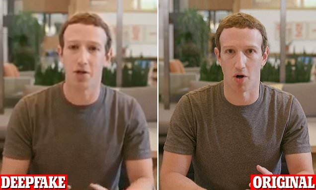

## How Deepfake Technology Has Been Used So Far

According to Virtual Humans (n.d.), deepfake is “a branch of synthetic media in which a person in an existing image or video is replaced with someone else’s likeness using artificial neural networks.” In Ramussen’s article (2021), what sets deepfake apart from other “virtual beings'' (specifically vtubers) and pure Artificial Intelligence (A.I.) is that both the media replaced and the likeness used to replace with already exist and are not generated from of nothing. Deepfake is unlike Alice, the “NFT powered by artificial intelligence and deep machine learning algorithms that make her an iNFT or intelligent NFT,” and it is not like Kizuna AI, a virtual character that moves at the same time as the human behind the face, using motion capture technology, allowing real-time interaction (Ramussen, 2021).

However, deepfakes are more known as visual effects technology used in movies to de-age actors and bring dead people back to life (Miller, 2022). This technology can offer cheaper options when it comes to production. As deepfakes work through the power of machine learning, more usage of deepfakes will make it easier to detect faces and edit them. In an article by Panyatham (2022), the use of deepfakes in the production process of entertainment is predicted. In this sense, it could easily outdo technologies such as CGI. Deepfakes could offer more convenience not only in video but also audio since it relies on A.I. This could easily disrupt the industry of manual editing through software since everything would be more accessible as long as A.I. learns repeatedly.

Furthermore, deepfake offers multiple language dubbing, which easily disrupts the industry of voice acting. Since deepfakes allow the placement of a person’s face to another, it could create a new era of actors who don’t want to show their faces and could perform through facial expressions and body movements. However, it’s also a threat to current actors since all that’s needed is their face to make a production with lower costs. The value and demand for their performance could be easily diminished since they have become more replaceable.

Moreover, deepfakes could create a new population of malicious users- people with ill intentions of deceiving others. It is “a perfect weapon for purveyors of fake news who want to influence everything from stock prices to elections.” (Shao, 2020). This possibility makes deepfake a new-market disruption since it’s a new technology still in its infancy but is already widely accessible through mobile apps. Additionally, deepfakes are prominently used in pornography. While it does not disrupt a certain innovation, it poses a threat to the security of women as they are the most common target of deepfake porn. According to Sensity AI, a research company that has tracked online deepfake videos since December of 2018, 90-95% of deepfakes are nonconsensual porn. In this context, deepfakes can create a new population of users in the form of people who seek power through revenge porn (Hao, 2021).

Moreover, deepfakes could create a new population of malicious users- people with ill intentions of deceiving others, specifically scammers. In an article by Ferrier, it mentioned how deepfake was used by a scammer to synthesize the CEO’s voice and transferred £220,000 from a German energy firm’s U.K. subsidiary to a Hungarian bank account. In other cases, deepfakes have also been used to spread false information by creating videos of politicians and celebrities giving statements they have never made before in reality. Deepfake also extends to audio, with an example of John F. Kennedy reading a speech he never got to say before his death. 

Deduced from these examples, we can say deepfake can pose a threat to security to the public – not only to their identity through digital and social media but also their monetary assets in financial institutions can become at risk. This could also disrupt the role of moderators in social media as it has become harder to distinguish which is a real user or a deepfake. In a 2020 article by Vincent, it’s predicted that Facebook will have a hard time moderating deepfakes after a deepfake video of their CEO, Mark Zuckerberg, circulated on Instagram in that same year. Even if it was a form of misinformation, Facebook did not remove it as according to them, it was not violating any of its policies. Clearly, as deepfake is still relatively new, violations it causes are still being identified, while safety policies and guidelines are modified to accommodate these new additions.

### Takeaway
- _Using deepfake for creating malicious content can give people the wrong idea on how to use innovations from the field of AI and machine learning (Buzz Blog Box, 2020)._
- _The entertainment industry is also negatively impacted by deepfakes. Faces of celebrities are swapped into sexually explicit images or videos – tarnishing their reputation (Buzz Blog Box, 2020)._
- _Deepfakes are used to create fake contents which can sway a person’s belief towards a specific topic (Buzz Blog Box, 2020)._

#### References:

Buzz Blog Box. (2020, February 1). _How Deepfake Technology Impact the People in Our Society?_ Medium. [https://becominghuman.ai/how-deepfake-technology-impact-the-people-in-our-society-e071df4ffc5c](https://becominghuman.ai/how-deepfake-technology-impact-the-people-in-our-society-e071df4ffc5c)

Ferrier, E. (2022, June 24). _The Pros and Cons of Deepfake Technology, Google News gets a redesign, TikTok’s Platform Strategy revealed, and Instagram’s main feed to be revamped_. Intelligency Group | Digital Intelligence & Marketing. [https://www.intelligencygroup.com/blog/digital-roundup-24-6-22/](https://www.intelligencygroup.com/blog/digital-roundup-24-6-22/)

Hao, K. (2021, February 16). _Deepfake porn is ruining women’s lives. Now the law may finally ban it_. MIT Technology Review. [https://www.technologyreview.com/2021/02/12/1018222/deepfake-revenge-porn-coming-ban/](https://www.technologyreview.com/2021/02/12/1018222/deepfake-revenge-porn-coming-ban/)

Miller, T. (2022, March 21). _How Deepfake Technology Is Changing The Movie Industry_. Seat42F. [https://seat42f.com/how-deepfake-technology-is-changing-the-movie-industry/](https://seat42f.com/how-deepfake-technology-is-changing-the-movie-industry/)

Panyatham, P. (2022, August 16). _Deepfake Technology in the Entertainment industry: Potential Limitations and Protections_. AMT Lab @ CMU. [https://amt-lab.org/blog/2020/3/deepfake-technology-in-the-entertainment-industry-potential-limitations-and-protections](https://amt-lab.org/blog/2020/3/deepfake-technology-in-the-entertainment-industry-potential-limitations-and-protections)

Ramussen, M. (2021, September 27). _What's the difference between Virtual Influencers, VTubers, Artificial Intelligence, Avatars, and more?_ Virtual Humans. [https://www.virtualhumans.org/article/whats-the-difference-between-virtual-influencers-vtubers-artificial-intelligence-avatars](https://www.virtualhumans.org/article/whats-the-difference-between-virtual-influencers-vtubers-artificial-intelligence-avatars)

Shao, G. (2020, January 17). _What “deepfakes” are and how they may be dangerous_. CNBC. 

Vincent, J. (2020, January 15). _Facebook’s problems moderating deepfakes will only get worse in 2020._ The Verge. [https://www.theverge.com/2020/1/15/21067220/deepfake-moderation-apps-tools-2020-facebook-reddit-social-media](https://www.theverge.com/2020/1/15/21067220/deepfake-moderation-apps-tools-2020-facebook-reddit-social-media)

Virtual Humans. (n.d.) _Deepfake definition_. [https://www.virtualhumans.org/term/deepfake](https://www.virtualhumans.org/term/deepfake)
