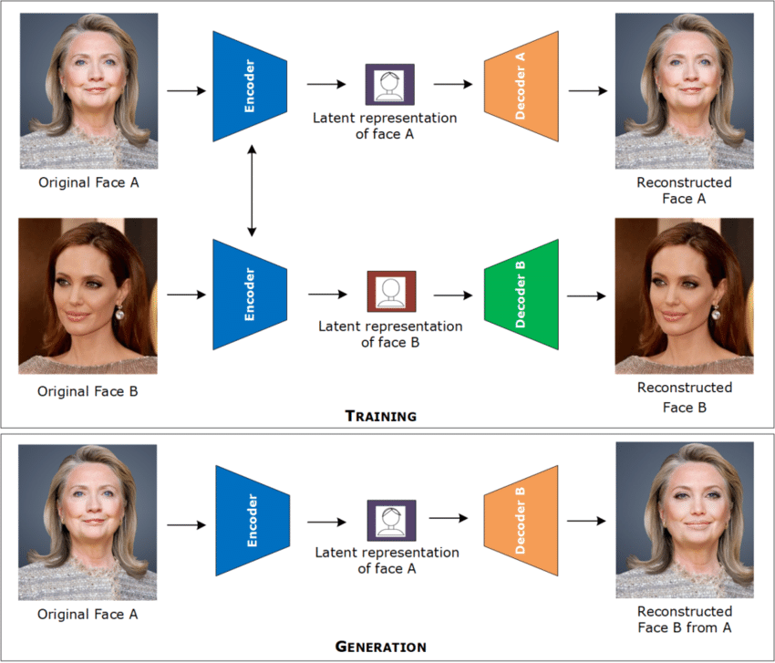

## How do Deep Fakes work?

Modern knowledge of deepfake as a trend, started in a reddit forum that featured faceswaps of actors in pornographic materials back in late 2017 (Somers, 2020). The word “deepfake” is coined from merging the words “deep learning” and “fake” (Brandon, 2018). Its mainstream original use was applied to public personalities that have many digital image materials available to train in order to develop a fake video or photo overlay of the same person into an existing piece of media product, completely out of context.

_How deepfakes are created. (Image source: Ali Javed)_

According to Batir (2021), the most basic algorithm used by deep fake AIs is called Deep Autoencoder, which has two components. The first component is the **_encoder_**, which tracks the primary facial structure of the overlay image to identify its fundamental facial feature, allowing the second component, the **_decoder_**, to align the superimposed faces together and reconstruct the original image’s face over the overlay face to make it have the original image’s body.
 
 Despite the recent emergence of deep fake as a technology, its origins actually go back to as early as the 1990s, under the Video Rewrite program which advanced the technology of face recognition and swapping, though quite apparent with its syntheticity.
 
The general workflow of creating deepfakes is shared in a blog on Inspired eLearning (2022), entitled “The Biggest Trends in Deepfake Detection in 2022”. It includes:
- Gathering reference images or footage;
- Aligning facial structure of the source object to its target object;
- Using the deep learning algorithm to train from the source material and original target material;
- Converting data into superimposed images; and
- Exporting as a finished deep fake product.
 
 While this sounds fairly simple, the time it takes to train source material of the face the AI user wants to swap into a clip may take days to achieve, requiring footage worth countless hours, with varying angles and emotions from the facial data set.
 
## Why is Deepfake Considered Disruptive Technology?
 
In the recent hike of social media users due to the shift of the larger population online amidst the COVID-19 pandemic, the popularity of deepfakes has now scattered throughout cyberspace. In its initial branding of being used as a malicious technology, many communities have found the concept of face swapping media products to be rather useful. Since then, deepfake technology has reached areas of voice manipulation and still image generation of realistic faces that do not exist in the physical world, and even superimposing bodies onto a person’s body data set (Somers, 2020). This eventually led to the preference of calling deep fakes as a more neutral locution, “AI-generated synthetic media”.

Because deepfake is now a proliferated technological service online, it creates an entirely new pool of target consumers. Theoretically, deepfake-generated visual 
effects take less financial investment and labor resources as opposed to a full audio-visual production. It is, essentially, categorized as disruptive innovation due to its completely new method multimedia generation. Christensen (n.d.) defines disruptive innovation as a streamline product or service which appeals to divergent consumers from the usual demographical pool. As a disruptor of the sustained film industry, it diminishes the high-cost timebound nature of traditional film sets. Thus, deepfake technology caters to more independent low-budget producers who require audio-visual material that is generated at a faster pace.

As of 2022, deepfake users appear in many platforms, each with varying background and selected media niche. For more flexible and complex AI-generated material, deepfake software such as DeepFace Labs, Faceswap, First Order Model, and [Wav2Lip](https://github.com/Rudrabha/Wav2Lip), a GitHub library that allows manipulation 
of images and footages into lip-syncing a .wav file (Sandusky, 2021). Softwares such as these require moderate knowledge on programming languages such as Python and a dedicated graphics card due to machine learning interfaces a user will need to interact with (Sandusky, 2021).

Meanwhile, there are also smartphone applications such as FaceApp, Face Swap Live, and many others that have already surfaced and are available for free access to its supported user devices. This means that there are both lightweight and expert platforms available for users ranging from hobbyists to professional producers.

This is also the reason why we see many content creators and regular social media users have the chance to operate deepfake technologies. Subsequently, the increase of people that have access to relatively professional tools in the modern age, will create a separate user market that relies heavily on the convenience and subcultural content that deepfake is able to project.

### References

Brandon, J. (2018, February 20). _Terrifying high-tech porn: Creepy 'deepfake' videos are on the rise._ Fox News. Retrieved from [https://www.foxnews.com/tech/terrifying-high-tech-porn-creepy-deepfake-videos-are-on-the-rise](https://www.foxnews.com/tech/terrifying-high-tech-porn-creepy-deepfake-videos-are-on-the-rise)

Batir, S. (2021,) _What is Deepfake? How Deepfakes Work? Deepfakes Explained 2022_. YouTube. Retrieved from [https://www.youtube.com/watch?v=AMq5k88QBgY&ab_channel=SeanBatir](https://www.youtube.com/watch?v=AMq5k88QBgY&ab_channel=SeanBatir)

Christensen, C. M. (n.d.). Disruptive Innovation. In _The Encyclopedia of Human-Computer Interaction._ Interaction Design Foundation. Retrieved from [https://www.interaction-design.org/literature/book/the-encyclopedia-of-human-computer-interaction-2nd-ed/disruptive-innovation.</a>](https://www.interaction-design.org/literature/book/the-encyclopedia-of-human-computer-interaction-2nd-ed/disruptive-innovation.</a>)

Javed, A. (2021, February). _Creation of a Deepfake using an auto-encoder and decoder_. ResearchGate.net. Retrieved from [https://www.researchgate.net/figure/Creation-of-a-Deepfake-using-an-auto-encoder-and-decoder-The-same-encoder-decoder-pair_fig2_349703826](https://www.researchgate.net/figure/Creation-of-a-Deepfake-using-an-auto-encoder-and-decoder-The-same-encoder-decoder-pair_fig2_349703826)

“The Biggest Trends in Deepfake Detection in 2022”. (2022, August 26). Inspired eLearning. Retrieved from [https://inspiredelearning.com/blog/the-biggest-trends-in-deepfake-detection-in-2022/#:~:text=Deepfakes%20are%20rapidly%20becoming%20a,to%20manipulate%20faces%20in%20videos](https://inspiredelearning.com/blog/the-biggest-trends-in-deepfake-detection-in-2022/#:~:text=Deepfakes%20are%20rapidly%20becoming%20a,to%20manipulate%20faces%20in%20videos)

Sandusky, M. (2021, May 4). _The Best DeepFake Software – How To Make A Deepfake._ Peer Through Media. Retrieved from [https://peerthroughmedia.com/deepfake-software-testing/.](https://peerthroughmedia.com/deepfake-software-testing/.)

Somers, M. (2020, July 21). _Deepfakes, explained_. MIT Management Sloan School. Retrieved from [https://mitsloan.mit.edu/ideas-made-to-matter/deepfakes-explained.](https://mitsloan.mit.edu/ideas-made-to-matter/deepfakes-explained.)
