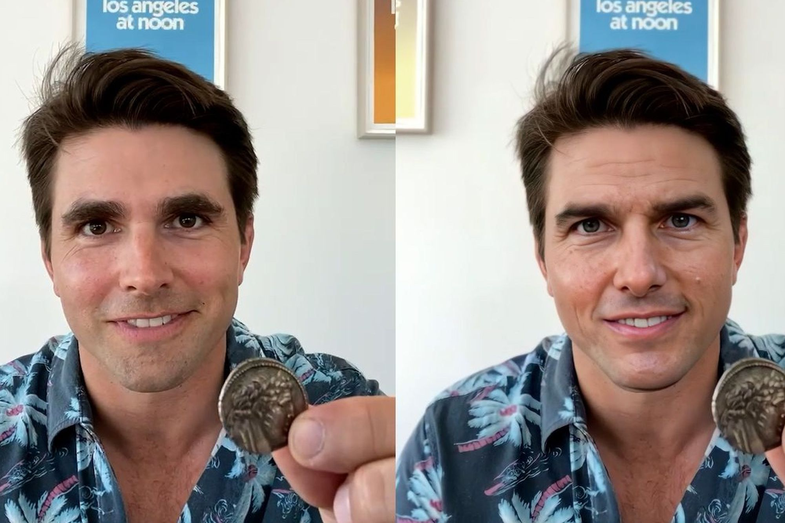

## Table of Contents

### I. Disruptive Technology

Defining its description and purpose, how it works, and the advantages and disadvantages found in disruptive technology.

1. [What is Disruptive Technology?](what_is_disruptive_technology.md)
2. [Disruptive Technology and Deepfakes](article_3.md)

### II. Deepfake and How our chosen topic disrupts the status quo in the market

1. [What are Deepfakes?](deepfakes.md)
2. [How Do Deepfakes Work?](article4.md)
3. [How Deepfake Technology Has Been Used So far](article.md)
4. [Disrupted Markets](article1.md)
5. [Deepfake Detection](deepfake_detection.md)

### III. Deepfake in the Philippine Context

- [DeepFakes in the Philippine Context](Philippine_context.md)

### IV. Summary

- [3 Summaries of the Web Report](Compile_Contributions.md)

---

<!-- text goes here -->

Videos of "fake" Tom Cruise have been getting viral throughout Tiktok, and the account has been gaining traction with  3.7 million followers and 14.4 million likes. What's special about these videos is that Tom Cruise isn't actually the person in front of the camera. His face is just plastered on the head of another man to fit with the movements and make it look convincing as if he's the one doing the actions. This technology, also know as "deepfake" has been on the rise recently, bringing both convenience and chaos in the Internet. In this repository, we are going to discuss how deepfake became a disruptive technology, including the innovations it has disrupted and will disrupt in the future.

### About Group H

MMS142 Group H's repository for the Group Activity: Disruptive Technologies.
The topic chosen is Deepfake or technology that can alter visages.

The following are it's members:

1. Parcon, Pamela Mae
2.  Pascual, Alexander
3. Pavillar, Jeffrey
4. Perez, Jose Claro Miguel
5. Picar, Ray-Anne Janoah
6. Pil, April Rose
7. Pineda, Maria Elisa
8. Ponciano, Niezl Marian
9. Portugal, Iñigo
10. Puda, Jeneen Antoinette Louise
11. Rabara, Frances Adelaide
12. Ramos, Cesar, III
13. Recto, Bea Phoemela
14. Reyes, Sasha Gabriel
