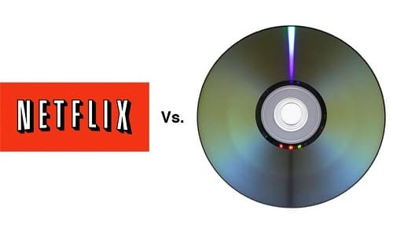

## What is Disruptive Technology?

Disruptive technology are innovations originating from low-end or new-market foothold that are capable of disrupting existing markets and value networks (McKelvey, 2020). According to Smith(2022), disruptive technology overtakes systems, habits, or even fellow innovations as it is more superior and convenient. It may also change how consumers, industries, or businesses work . A common example of disruptive technology is Netflix and streaming services overtaking DVD-renting services as films are digitized for the audience’s consumption (Zaman, 2022).

### Technological advancement plays a huge role in the development of disruptive technologies

Disruptive technology refers to a form of technology that affects the way a market, business, or industry functions the way it used to. Disruptive technology is usually a result of adaptation and modernization.

**Deepfake** is a type of Artificial Intelligence used to create an altered image, audio, or video. (How can an audio be a deep fake? This is contrary to our understanding that this is only limited to images and video).

 A deepfake is being created by using  two Artificial Intelligence or AI algorithms namely, the **generator** and the **discriminator**.

_What market/industries are currently disrupted by deepfakes? Answer: Media and entertainment industry._

- [_What are deepfakes?_](deepfakes.md)
- [_How Do Deep Fakes Work?_](article4.md)
- [_How Deepfake Technology Has Been Used So Far_](article.md)
- [_Philippine Context_](Philippine_context.md)

#### References:

McKelvey, J. (2020). _Good entrepreneurs don't set out to disrupt_. Harvard Business Review.[https://hbr.org/2020/05/good-entrepreneurs-dont-set-out-to-disrupt](https://hbr.org/2020/05/good-entrepreneurs-dont-set-out-to-disrupt)

Smith, T. (2022, April 2). _Disruptive Technology: Definition, Example, and How to Invest_. Investopedia. Retrieved December 17, 2022, from [https://www.investopedia.com/terms/d/disruptive-technology.asp](https://www.investopedia.com/terms/d/disruptive-technology.asp)
 
Zaman, R. (2022). _Netflix disruptive innovation – renting to streaming_. The Waves.[https://www.the-waves.org/2022/03/15/netflix-disruptive-innovation-renting-to-streaming/](https://www.the-waves.org/2022/03/15/netflix-disruptive-innovation-renting-to-streaming/)
  
